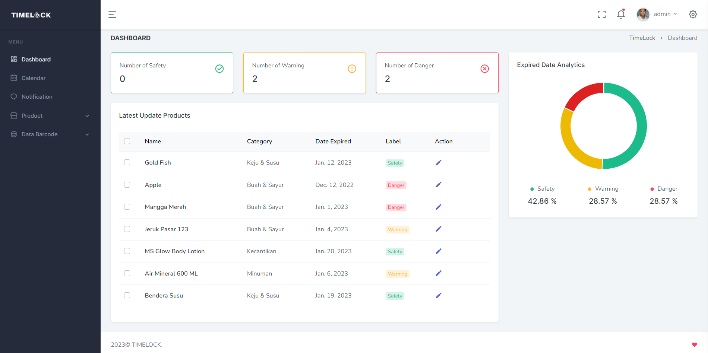

# product-expiration-reminder
Product Expiration Reminder


### Abstrak

Laporan ini merangkum kegiatan Studi Independen Bersertifikat (SIB) yang
dilakukan di Kampus Merdeka bersama mitra perusahaan Orbit Future Academy
(OFA). Projek yang dikerjakan bertujuan untuk memecahkan masalah pencatatan
tanggal kadaluarsa produk dengan menggunakan Deep Learning dan pendekatan
Transfer Learning. Kami melatih Convolutional Neural Network (CNN) –
Inception ResNet V2 dengan kumpulan data sintetik berisi gambar tanggal
kadaluarsa dan gambar buah-buahan. Hasilnya, Inception ResNet V2 berhasil
mendapatkan akurasi 0,9961 dan 0,9955 untuk masing-masing data yang kami latih.
Kami juga menerapkan model tersebut ke dalam aplikasi berbasis web untuk
membantu pengguna dalam merekam dan melacak tanggal kadaluarsa secara cepat
dan efisien. Kegiatan SIB ini memberikan pengalaman dan pengetahuan
bermanfaat bagi peserta, serta menjadi bukti kompetensi dalam bidang teknologi
informasi.

**Kata kunci**: Studi Independen, Bersertifikat, Deep Learning, Transfer Learning,
Tanggal Kadaluarsa, Orbit Future Academy


### Installation Guide

NOTE: This project is only working on python 3.7

1. Clone this repository
    ```bash
    git clone https://github.com/Da-Risset/product-expiration-reminder.git
    
    cd product-expiration-reminder
   ```
2. Install the dependencies
    ```bash
    pip install -r requirements.txt
    pip install tensorflow
    ```
3. Setup environment variables
    ```bash
    cp .env.example .env
    ```
4. Setup Database
    ```bash
    python manage.py migrate
    ```
5. import the data
    ```bash
    python manage.py import_data --path <path_to_data>
    ```
6. Create superuser
    ```bash
    python manage.py createsuperuser
    ```
7. Run the server
    ```bash
    python manage.py runserver
    ```
8. Open the application in your browser
    ```bash
    http://localhost:8000
    ```
9. Test the application
    ```bash
    python manage.py test
    ```
   
### License
MIT License (MIT) - see [LICENSE](LICENSE) for more details

### Authors
- Danang Haris Setiawan [GitHub](https://github.com/danangharissetiawan), [Site](https://danangharis.com)
- Arya Erlangga [GitHub](https://github.com/orgs/Da-Risset/people/NotFound909)
- Aris Dwi Wahyudi [GitHub](https://github.com/orgs/Da-Risset/people/Arisdwi666)
- Athifah Setyo Wahyuningsih [GitHub](https://github.com/orgs/Da-Risset/people/ATHIFAHS)
- Dini Wulansari [GitHub](https://github.com/orgs/Da-Risset/people/diniwulansari)

### Acknowledgements
- Orbit Future Academy
- Kampus Merdeka
- [Keras](https://keras.io/)
- [Tensorflow](https://www.tensorflow.org/)
- [Django](https://www.djangoproject.com/)
- [Django Rest Framework](https://www.django-rest-framework.org/)

### References
- [Deep Learning for Computer Vision with Python](https://www.pyimagesearch.com/deep-learning-computer-vision-python-book/)

### Screenshots


### Video
[](https://drive.google.com/file/d/1zNgCnN7yMsWTkHTjxcM8nx2jWcI3naa7/view?usp=share_link)

### Repository Includes
- Fruit Quality Detection [GitHub](https://github.com/Da-Risset/fruit-quality)
- Barcode Detection [GitHub](https://github.com/Da-Risset/barcode-recognition)
- Date Detection [GitHub](https://github.com/Da-Risset/date-expired)
- Product Expiration Reminder [GitHub](https://github.com/Da-Risset/product-expiration-reminder)